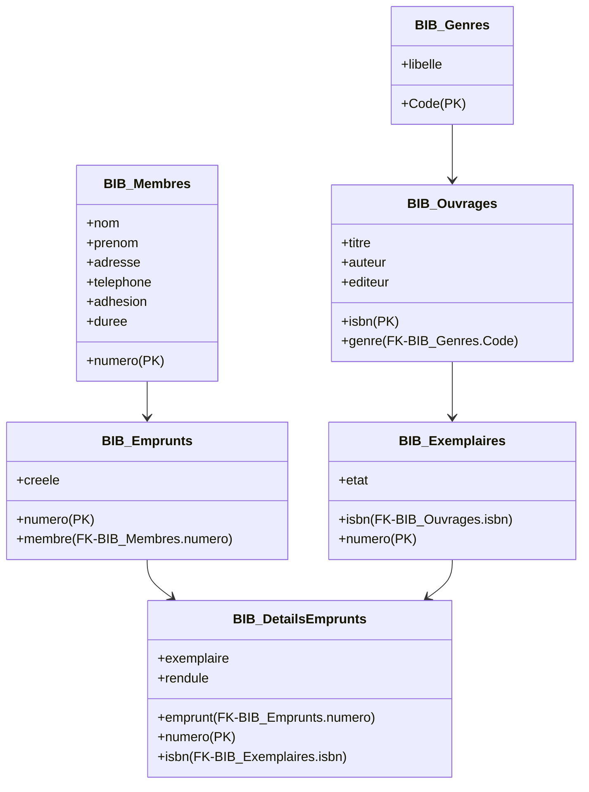

# SQLOracle

Projet for oracle sql course

## Diagramme of the database

```mermaid

classDiagram
    class BIB_Genres {
        +Code(PK)
        +libelle
    }
    class BIB_Ouvrages {
        +isbn(PK)
        +titre
        +auteur
        +genre(FK-BIB_Genres.Code)
        +editeur
    }
    class BIB_Exemplaires {
        +isbn(FK-BIB_Ouvrages.isbn)
        +numero(PK)
        +etat
    }
    class BIB_Membres {
        +numero(PK)
        +nom
        +prenom
        +adresse
        +telephone
        +adhesion
        +duree
    }
    class BIB_Emprunts {
        +numero(PK)
        +membre(FK-BIB_Membres.numero)
        +creele
    }
    class BIB_DetailsEmprunts {
        +emprunt(FK-BIB_Emprunts.numero)
        +numero(PK)
        +isbn(FK-BIB_Exemplaires.isbn)
        +exemplaire
        +rendule
    }

    BIB_Genres --> BIB_Ouvrages
    BIB_Ouvrages --> BIB_Exemplaires
    BIB_Membres --> BIB_Emprunts
    BIB_Emprunts --> BIB_DetailsEmprunts
    BIB_Exemplaires --> BIB_DetailsEmprunts

```
